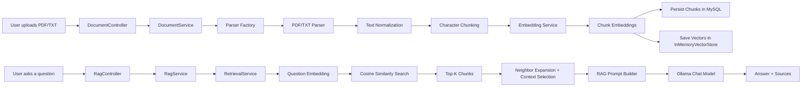
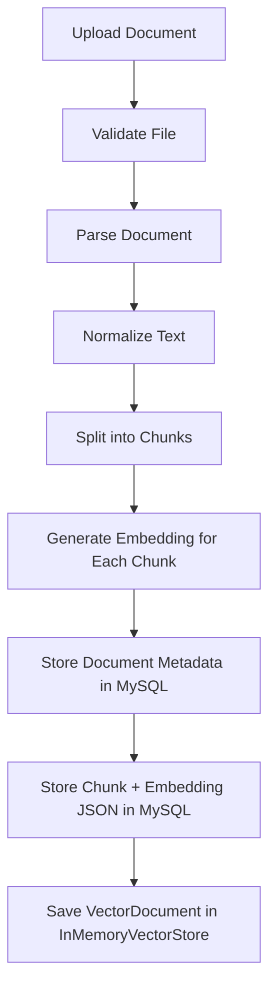
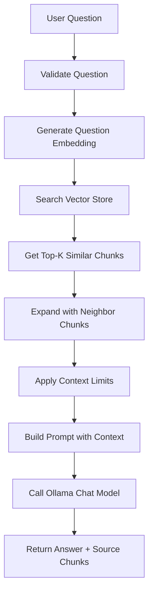

# AI Document Knowledge Assistant

## Overview

This project is a **Spring Boot based AI Document Knowledge Assistant** that allows users to upload documents, convert them into searchable embeddings, store them safely, and ask natural-language questions over the uploaded content.

The application uses a **RAG (Retrieval-Augmented Generation)** approach:

- documents are parsed and chunked,
- embeddings are generated for each chunk,
- chunk embeddings are persisted in **MySQL**,
- vectors are loaded into an **in-memory vector store** on startup,
- user questions are embedded and matched using **cosine similarity**,
- the most relevant chunks are sent to **Ollama** to generate grounded answers.

---

## Problem Statement

Reading long PDF or text documents manually is slow and inefficient.

Users often want quick answers such as:

- What are the main topics in this document?
- What does the policy say about remote work?
- Which section explains a specific concept?

Without semantic search, users need to scan the whole document themselves.

---

## What This Project Solves

This project turns uploaded documents into a searchable knowledge base and helps users:

- upload PDF and text documents,
- search semantically instead of keyword-only matching,
- ask questions in natural language,
- get answers grounded in retrieved document chunks,
- see the supporting source chunks used to produce the answer.

In short, it works as a **document-aware Q&A assistant**.

---

## Key Features

- **PDF and TXT document ingestion**
- **Automatic text normalization and chunking**
- **Embedding generation using Ollama**
- **Chunk metadata + embedding persistence in MySQL**
- **In-memory vector search for fast retrieval**
- **Cosine similarity based ranking**
- **Neighbor expansion for better context continuity**
- **Context size controls** to keep prompts manageable
- **Grounded RAG responses** with source references
- **Startup reload from MySQL to vector store**

---

## High-Level Architecture



---

## Document Ingestion Flow



---

## Question Answering Flow



---

## Startup Reload Behavior

When the application starts:

1. all persisted document chunks are loaded from **MySQL**,  
2. stored embedding JSON is deserialized into `List<Float>`,  
3. each chunk is converted into a `VectorDocument`,  
4. all vectors are inserted into the in-memory vector store.

This means uploaded documents remain available for semantic search even after restarting the application.

---

## Tech Stack

### Backend
- **Java 21**
- **Spring Boot 4**
- **Spring Web MVC**
- **Spring Data JPA**
- **Spring Validation**

### AI / RAG
- **Ollama**
- **Embedding model:** `nomic-embed-text`
- **Chat model:** `llama3.2:3b`
- **Cosine similarity search**
- **In-memory vector store**

### Database / Document Processing
- **MySQL**
- **Apache PDFBox**

### Developer Utilities
- **Lombok**
- **MapStruct**
- **Springdoc OpenAPI**
- **Maven**

---

## Main Components

| Component | Responsibility |
|---|---|
| `DocumentController` | Accepts document uploads |
| `DocumentServiceImpl` | Coordinates parsing, chunking, hashing, persistence, and embedding |
| `CharacterChunkingService` | Splits normalized text into overlapping chunks |
| `OllamaEmbeddingService` | Generates embeddings for text chunks and questions |
| `DocumentEmbeddingService` | Stores chunks in MySQL and vectors in memory |
| `InMemoryVectorStore` | Holds embeddings for semantic search |
| `VectorStoreLoader` | Reloads persisted vectors into memory on startup |
| `RetrievalServiceImpl` | Performs top-K retrieval, neighbor expansion, and context selection |
| `RagPromptBuilder` | Builds the final LLM prompt |
| `RagService` | Orchestrates retrieval + prompt + answer generation |
| `RagController` | Exposes the RAG question-answer API |

---

## API Endpoints

### 1. Upload a document

**Endpoint**

```http
POST /api/documents
```

**Content-Type**

```http
multipart/form-data
```

**Form field**

- `file` → PDF or TXT file

---

### 2. Ask a question

**Endpoint**

```http
POST /api/rag/ask
Content-Type: application/json
```

**Request**

```json
{
  "question": "What are the main topics?"
}
```

**Response**

```json
{
  "answer": "...",
  "sources": [
	{
	  "documentId": "...",
	  "chunkIndex": 76,
	  "similarity": 0.56
	}
  ]
}
```

---

## Configuration

The main runtime settings are currently configured in `src/main/resources/application.properties`.

### Important Properties

| Property | Purpose | Current Value |
|---|---|---|
| `server.port` | Application port | `8098` |
| `spring.datasource.url` | MySQL connection URL | local MySQL |
| `spring.datasource.username` | MySQL username | `root` |
| `spring.datasource.password` | MySQL password | `${DB_PASSWORD:change-me}` |
| `app.chunking.chunk-size` | Max chunk size | `1000` |
| `app.chunking.overlap` | Chunk overlap | `200` |
| `app.embedding.ollama.base-url` | Ollama base URL | `http://localhost:11434` |
| `app.embedding.ollama.model` | Embedding model | `nomic-embed-text` |
| `app.ollama.chat-model` | Chat model | `llama3.2:3b` |
| `app.rag.retrieval.top-k` | Number of semantic matches to retrieve | `5` |
| `app.rag.retrieval.neighbor-radius` | Number of nearby chunks to include | `1` |
| `app.rag.context.max-chunks` | Max chunks sent to prompt | `8` |
| `app.rag.context.max-characters` | Max total context size | `5000` |

---

## Local Setup

### Prerequisites

- Java 21
- Maven Wrapper (`mvnw` / `mvnw.cmd` already included)
- MySQL running locally
- Ollama installed and running locally

### Start Ollama models

Make sure the following models are available in Ollama:

```powershell
ollama pull nomic-embed-text
ollama pull llama3.2:3b
```

### Set database password

Before running the application, set the environment variable:

```powershell
$env:DB_PASSWORD="your_mysql_password"
```

### Run the project

```powershell
cd <project-folder>
.\mvnw.cmd spring-boot:run
```

### Run tests

```powershell
cd <project-folder>
.\mvnw.cmd test
```

---

## Design Notes

- **MySQL** is used for persistence of document metadata and chunk embeddings.
- **InMemoryVectorStore** is used for fast semantic search during runtime.
- The vector store is intentionally rebuilt from persisted chunk embeddings at startup.
- The system uses **RAG grounding rules** so answers stay tied to retrieved content.
- Neighbor expansion helps preserve local context around strong semantic matches.

---

## Current Scope

This repository focuses mainly on the **AI document knowledge assistant** workflow:

- document upload,
- parsing,
- chunking,
- embedding generation,
- semantic retrieval,
- grounded answer generation.

It is designed as a beginner-friendly Java + Spring Boot + RAG learning project with production-style structure.

---

## Future Improvements

Possible future enhancements:

- support more document formats,
- add document deletion endpoints with full cleanup,
- improve package naming consistency (`parcer`, `reposiotry`, `responce`),
- add integration tests for upload and RAG flows,
- add Docker support for local setup.

---

## Summary

This project demonstrates how to build a practical **AI-powered document question-answering system** using:

- **Spring Boot** for backend APIs,
- **MySQL** for persistence,
- **Ollama** for embeddings and answer generation,
- **RAG architecture** for grounded, document-aware answers.

It is a complete end-to-end example of building an **AI Document Knowledge Assistant** in Java.
